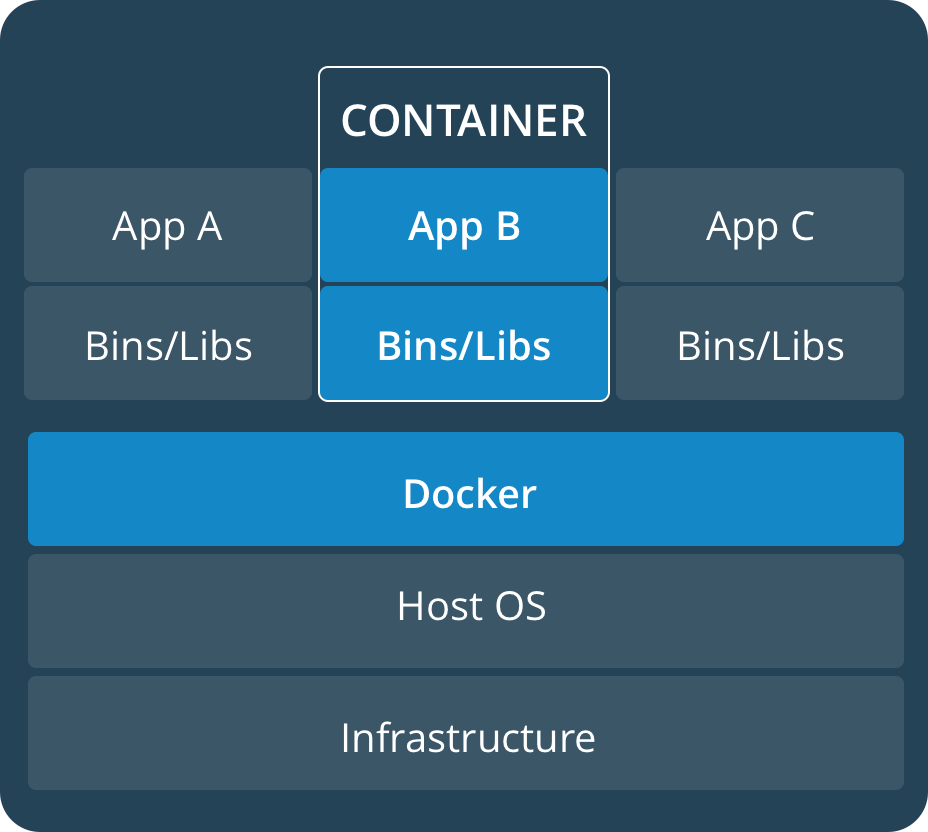

# Docker as development enviroment
---

## TODO
1. Introduccción 
2. Crear nuestra propia imagen
3. Probemos: GO ON!

## Introduction

### ¿Docker?
<div style="width: 70%; margin: 0 auto;">
	
</div>

> Open-source project that automates the deployment of software applications inside containers by providing an additional layer of abstraction and automation of OS-level virtualization. *[Wikipedia](https://en.wikipedia.org/wiki/Docker_(software))*

Herramienta que permite encapsular aplicaciones en un entorno unificado que contenga todas las dependencias y archivos necesarios y que pueda ejecutarse en cualquier sistema operativo anfitrión. Permite desplegar software en un entorno (contenedor) universal.

### ¿Qué es un contenedor?
<div style="display: inline-block">
	<div style="float: left; width: 47%">
		
	</div>
	<div style="width: 47%; float: right;">
		
	</div>
</div>

Fragmento de software que contiene todo lo necesario para ejecutarse, garantizando un identico funcionamiento en cualquier entorno donde se ejecute.

En contraposición, y comúnmente usadas con el mismo proposito, existen las máquinas virtuales, que ofrecen un aislamiento total del sistema operativo anfitrión, ya que incluso virtualizan el hardware que utilizan. Sin embargo, esta ventaja penaliza mucho, incrementando el tamaño de estas imágenes y disminuyendo el rendimiento.

Docker, igual que LXC (Linux Containers) utiliza los **cgroups** y **namespaces** de Linux para proveer de aislamiento a los contenedores y otros procesos que corren en el anfitrión.

- **cgroups**: Controlan los recursos que utilizan un grupo de procesos (CPU, memoria, GPU, ...)
- **namespaces**: Otorga aislamiento a nivel de proceso.

#### ¿Y por qué Docker y no LXC?
Los Docker Containers ofrecen una serie de características en contraposición a las que ofrece LXC. Ninguna de ellas se puede considerar mejor, pero si más o menos adecuada en según qué caso de uso:

- **Mono vs Multiproceso:** Mientras que LXC tiene un proceso `init` convencional, Docker solo permite un proceso en ejecución por contenedor. Esta restricción está diseñada para "obligar" a utilizar una arquitectura de microservicio, a parte de que tiene beneficios claros en el despliegue o la actualización de software.
- **Con o sin estado:** Docker está diseñado para no tener estado. No permite almacenamiento persistente si no es por medio de volumenes (que veremos más adelante). Además está diseñado para ser "solo lectura", si modificas un contenedor, docker creará una copia actualizada.
- **Portabilidad:** Docker abstrae mucho más las capas de red, almacenamiento, etc, lo que permite tener exactamente el mismo entorno en local que en producción.

#### Instalar Docker
Para instalar Docker debeis abrir la siguiente página, donde se explica cómo instalar la Community Edition en base a vuestro SO. 

```
https://www.docker.com/community-edition
```

## Crear nuestra propia imagen

Todo los archivos necesarios estan en este [repo](https://github.com/lucasmenendez/docker-as-development-enviroment). Basta con clonarlo:

```
	git clone https://github.com/lucasmenendez/docker-as-development-enviroment.git
```


### Dockerfile
`Dockerfile` es el fichero que define qué y cómo construir nuestra imagen para nuestro contenedor. Determina el sistema operativo base, el autor de la image, la ruta de trabajo, etc. Veamos una lista de los comandos que vamos a emplear:

- `FROM` Define el SO y la versión en la que se va a basar nuestro contenedor.
- `MAINTAINER` Indica el autor de la imagen.
- `COPY` Permite copiar ficheros locales dentro de nuestro contenedor.
- `RUN` Ejecuta un comando tras la creación del contenedor.
- `EXPOSE` Expone los puertos a utilizar.
- `ENTRYPOINT` Define qué comandos ejecutar al usar el contenedor como un ejecutable.
- `WORKDIR` Define la ruta de trabajo.

### Docker Compose
Se trata de una utilidad que permite definir y correr multiples contenedores con un solo comando. En nuestro caso definiremos dos contenedores, indicando en qué ruta debera hacer `build` Docker, y otros parámetros comos los volúmenes a montar y los puertos expuestos, así como establecer la conexión entre ambos contenedores. Este será nuestro `docker-compose.yml`:

```
version: '2'
services:
  mysql:
    build: ./mysql/
    volumes:
    - ./mysql:/var/lib/mysql
  flask:
    build: ./python/
    ports:
    - "5000:5000"
    links:
    - "mysql:mysql"
    volumes:
    - ./python:/workdir
```

### Nuestros Dockerfiles
Para esta charla vamos a trabajar en un entorno básico de MySQL + Flask (Python), por ello tendremos dos contenedores, aunque vamos a desplegar el servidor con Flask, esto debería hacerse a través de Apache o NGINX, pero eso para otra charla.

#### Python (Flask)
```
FROM debian:latest
MAINTAINER Lucas Menendez "epucas@gmail.com"

RUN apt-get update
RUN apt-get install -y python3 python3-dev python3-pip

COPY requirements.txt ./
RUN pip3 install -r requirements.txt

EXPOSE 5000
WORKDIR /workdir
ENTRYPOINT python3 /workdir/run.py > flask.log &
```

#### MySQL
```
FROM debian:latest
MAINTAINER Lucas Menendez "epucas@gmail.com"

RUN apt-get update
RUN DEBIAN_FRONTEND=noninteractive apt-get install -y mysql-server

COPY config.sql ./
ENTRYPOINT /usr/bin/mysqld_safe
```

Por último ejecutaremos el comando `docker-compose build` en la ruta donde tengamos nuestro `docker-compose.yml`.

### Comandos útiles

- `docker-compose up` Levanta todos los contenedores definidos.
- `docker-compose stop` Para todos los contenedores definidos que esten corriendo.
- `docker-compose top` Muestra los servicios que están corriendo por contenedor.
- `docker ps` Muestra los contenedores en ejecución. Con `-a` como argumento muestra todos los contenedores del host, y con `-q` lista solo los ID's.
- `docker rm <container_id>` Elimina los contenedores pasados como argumento.
- `docker images` Muestra las imagenes ya definidas en el host. Con `-q` lista solo los ID's.
- `docker rmi <image_id>` Elimina las imagenes pasadas como argumento.
- `docker exec -it <container_name> bash` Permite entrar en la cli de bash dentro del contenedor.

## Probemos: GO ON!